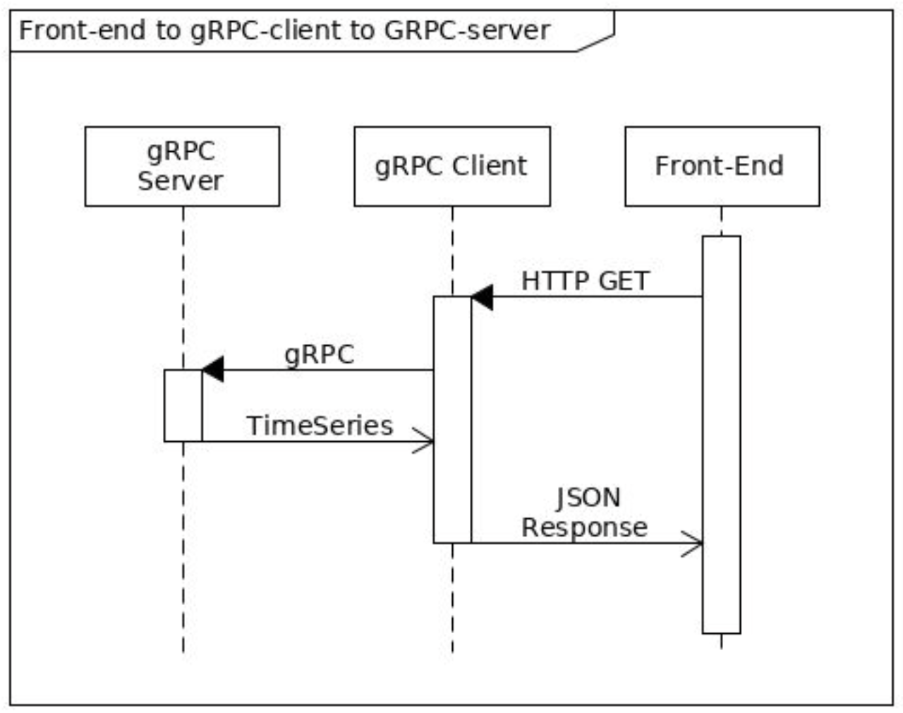

# gRPC-Based Microservice

## Table of Contents
1. [Task](#task)
2. [Challenge](#challenge)
   - [Data Source](#data-source)
   - [Data Cleaning](#data-cleaning)
3. [Future Enhancements](#future-enhancements)
4. [Technologies](#technologies)
   - [Python gRPC Server](#python-grpc-server)
   - [FastAPI](#fastapi)
   - [Typer](#typer)
   - [InfluxDB](#influxdb)
5. [How to Run](#how-to-run)
   - [Changing the Data Loader](#changing-the-data-loader)

## Task
  
Create a gRPC server that serves time-based electricity consumption data from `meterusage.csv`.

## Challenges

### Data Source:
CSV may not be the most efficient format for serving time-series data. Additionally, no specific database has been designated for this project, presenting a challenge in terms of loading data. To address this, I will integrate multiple data sources (such as InfluxDB) and design the code to be flexible, allowing support for different data sources for each metric.

To implement this, I will use the **Strategy Design Pattern** to handle different data loaders and the **Factory Design Pattern** to manage these loaders within the gRPC server.

### Data Cleaning:
I found a row in CSV file with NaN value. for now I just delete it :)

## Future Enhancements
1. **Additional Data Loaders:** Integrate other data loaders (e.g., TimescaleDB) for testing and comparing different time-series databases. This will help in determining the best fit for the project.

2. **Data Seeders:** Data seeders could be written to transform and load data into various data stores (InfluxDB, TimescaleDB, etc.), ensuring data compatibility across different databases.

3. **Streaming:** If the dataset grows large, we might introduce gRPC streaming to optimize data loading, providing real-time data to clients instead of loading all data at once.

## Technologies

### Python gRPC Server
We will use Python to create the gRPC server that serves the data.

### FastAPI
[FastAPI](https://fastapi.tiangolo.com/) is a modern, fast (high-performance) web framework for building APIs with Python. Based on standard Python type hints, it will be used to build the API layer of the project. The structure and best practices will follow the guidelines outlined in the [FastAPI Best Practices](https://github.com/zhanymkanov/fastapi-best-practices) repository.

### Typer
[Typer](https://typer.tiangolo.com/) is a library for building command-line interface (CLI) applications. It will be used for managing project commands, such as running the project, executing tests, and other administrative tasks.

### InfluxDB
[InfluxDB](https://www.influxdata.com/) is a database designed for storing and querying time-series data. It will be used to store electricity consumption data.

## How to Run
1. Navigate to the project directory:
   ```bash
   cd project
   ```
2. Start the services using Docker Compose:
   ```bash
   docker-compose up
   ```
3. Access the API documentation and interact with it at [http://localhost:8000/docs](http://localhost:8000/docs).

### Changing the Data Loader
Currently, there are two data loaders available for the metrics in the system: CSV and InfluxDB. You can switch between them in the gRPC server to load data for the metrics. The configuration is located in `project/grpc_server/app/server/service.py`.

#### CSV Loader
To use the CSV data loader, modify the code as follows:
```python
# CSV data_loader
data_loader = DataLoaderFactory.create_csv_loader('meterusage.csv')
self.metric = Metric(data_loader)
```

#### InfluxDB Loader
To use the InfluxDB data loader, update the code like this:
```python
# InfluxDB data_loader
data_loader = DataLoaderFactory.create_influxdb_loader(
    os.getenv('INFLUXDB_URL'),
    os.getenv('INFLUXDB_TOKEN'), 
    os.getenv('INFLUXDB_ORG')
)
self.metric = Metric(data_loader)
```